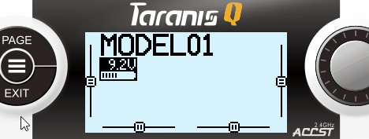

# betaflight-tx-lua-scripts-mod 
*based on release [1.3.0](https://github.com/betaflight/betaflight-tx-lua-scripts/releases/tag/1.3.0)*

## Changes
**+ Display telemetry screens inside betaflight**

**+ Configurable navigation controls, radio type independent**
  - added user events: `longPress.page`, `release.page`
  - added radio schemes: Taranis X-Lite, Taranis X9E
  - added controls:
    * ***Page back*\*** on long press [PAGE]
    * ***Back to first page*\*** on long press [MENU]
    * ***Close menu*** on release [MENU] button
    * ***Quit editing*** on release [MENU] button

**+ Minified script files** (thanks to [mathiasbynens/luamin](https://github.com/mathiasbynens/luamin))

##  

> \**You can not access other telemetry screen slots, cause its part of design. The input [PAGE] is used for stepping pages, similar to the OpenTX system menu.
Apply [a patch](https://github.com/Matze-Jung/betaflight-tx-lua-scripts-mod/tree/master/patches) if you want to have the original input mapping restored.*

##  

OpenTX provides only four telemetry screen slots and to me, the navigation doesn't seem to be very familiar. Sacrifice switches to trigger screens ain't an satisfying option either. The betaflight script has the capability of navigating screens already and is compatible to a range of radios. So why not use that?

With this mod the limit number of telemetry screens depend only on the system memory. Just list them in your platforms config file. You don't even have to display the betaflight screens if not needed.

Install this modified version just the way you're used to. First time users should have a glimpse at the [install instructions](#installing).

### Loading telemetry scripts
To add, change or reorder pages, edit the `PageFiles = { ... }` table in your `SCRIPTS/BF/[platform]/[platform]pre.lua` file.

Uncomment the first item of `PageFiles` to load the example home screen `../../TELEMETRY/exmpl1.lua` or insert your own scripts.
> *If you have TBS Crossfire, try* `../../../CROSSFIRE/crossfire.lua`

Order the pages to your needs. I prefer the vtx settings as last, one before home screen. Then long press [MENU], long press [PAGE] is a quick and rememberable action to access vtx settings.

Prepend `-- ` to the line to hide a page (e.g. rescue.lua and gps.lua, if you don't use GPS).

Use relative pathnames to refer external scripts.
If you add or edit pages, keep in mind that the radios internal memory isn't endless.

> *To layout and create custom telemetry screens, I would recommend a grid-system like [opentx-lua-widgets](https://github.com/Matze-Jung/opentx-lua-widgets).*

### Mapping navigation controls
The code wich handles the user events was abstracted from `ui.lua` into a table `ctrlSchema = { ... }` and placed in each `SCRIPTS/BF/[platform]/[platform]pre.lua` file.
The assignment of radio inputs to script actions depends now on this platform specific config.

For instance: if you want to have switching pages on the [DIAL WHEEL] input, change the condition of `ctrlSchema.display.prevPage` to `dial.left` and `ctrlSchema.display.nextPage` to `dial.right`.

To add a transmitter control schema based on its platform, just overwrite the affected table fields below the schema table (see overrides for X9E in `SCRIPTS/BF/X9/x9pre.lua` [for example](https://github.com/Matze-Jung/betaflight-tx-lua-scripts/blob/master/src/SCRIPTS/BF/X9/x9pre.lua#L101)).

This concept should have the potential to implement new coming radios much easier and be maintenanced separately from the core ui code.

### Memory warning
If you just copied the files, launched the script and a `not enough memory` warning appears, probably restarting the radio is the only thing to do here. If OpenTX still complains, try to delete all `.luac` files and make shure that you've did build OpenTX with the luac-option checked.

## Test environment
* [OpenTX v2.2.4](https://github.com/opentx/opentx) on Taranis Q X7, [Betaflight 4.0.5](https://github.com/betaflight/betaflight) on OmnibusF4 w/ R-XSR
* [Companion Sim v2.2.4](https://www.open-tx.org/) (*FrSky platforms only*)

> *Any [feedback](https://github.com/Matze-Jung/betaflight-tx-lua-scripts-mod/issues/new/choose) about testing on different hardware welcome.*

## Download
Please go to the [releases page](https://github.com/Matze-Jung/betaflight-tx-lua-scripts-mod/releases) to download the latest files.

## Building from source
- Be sure to have `LUA 5.2`and `Node.js` installed
- Run `npm install` from the root folder to install node modules
- Run `npm start`, `make` or `./bin/build.sh min` from the root folder with appropriate privileges (omit the `min` switch to build without minifying)
- Compiled/minified files will be created at the `obj` folder. Copy the files to your transmitter as instructed in the [Installing section](#installing) below as if you unzipped from a downloaded file.

## Control schema layout
| State  | Action | Event *(X7)* | Event *(X9)* |
| - | - | - | - |
| display | prevPage | *longPress.page* | *longPress.page* |
| | nextPage | *release.page* | *release.page* |
| | prevLine | *dial.left* | *release.plus* |
| | nextLine | *dial.right* | *release.minus* |
| | edit | *release.enter* | *release.enter* |
| | menu | *release.menu* | *release.menu* |
| | home | *longPress.menu* | *longPress.menu* |
| | exit | *release.exit* | *release.exit* |
| editing | decValue | *dial.left* | *release.plus* |
| | stepValue | *dial.right* | *release.minus* |
| | exit | *release.exit* or *release.enter* or *release.menu* | *release.exit* or *release.enter* or *release.menu* |
| displayMenu | prev | *dial.left* | *release.plus* |
| | next | *dial.right* | *release.minus* |
| | cnfrm | *release.enter* | *release.enter* |
| | exit | *release.exit* or *release.menu* | *release.exit* or *release.menu* |
> *The control schema is located in the `SCRIPTS/BF/[platform]/[platform]pre.lua` file.*

## User events
| Action  | Name |
| - | - |
| press | minus |
|   | plus |
|   | pageDown |
|   | pageUp |
| longPress | enter |
|   | menu |
|   | page |
| repeatPress | minus |
|   | plus |
| release | enter |
|   | exit |
|   | menu |
|   | minus |
|   | plus |
|   | page |
| dial | enter |
|   | left |
|   | right |

## Resources
* [Manual for OpenTX 2.2](https://opentx.gitbooks.io/manual-for-opentx-2-2)
* [OpenTX 2.2 Lua Reference Guide](https://opentx.gitbooks.io/opentx-2-2-lua-reference-guide/)
* [OpenTX Taranis Manual](https://opentx.gitbooks.io/opentx-taranis-manual)

---

# betaflight-tx-lua-scripts 1.3.0

### Important:

Some changes in the recently released OpenTX 2.2.1 cause this version to have less RAM available for lua scripts than previous versions. This often leads to problems when using the Betaflight TX lua scripts on the Taranis X9D. A discussion of these problems can be found [here](https://github.com/betaflight/betaflight-tx-lua-scripts/issues/97).
A potential fix to increase the amount of RAM available has been identified: (https://github.com/opentx/opentx/pull/5579).
For now, the recommendation is for users wanting to update OpenTX from 2.2.0 to 2.2.1 on a Taranis X9D (and keep using the Betaflight TX lua scripts) to hold on and monitor the situation, in the hope that OpenTX will release a version with this bugfix in the near future.

## Firmware Considerations
- Betaflight - As a best practice, it is recommended to use the most recent stable release of Betaflight to obtain the best possible results.
- Crossfire - v2.11 or greater
- FrSky - While most receivers work fine, it's recommended to update the XSR family of receivers to their most recent firmware version to correct any known bugs in SmartPort telemetry.

## Installing

!! IMPORTANT: DON'T COPY THE CONTENTS OF THIS REPOSITORY ONTO YOUR SDCARD !!

Unzip the files from the link above and drag the contents to your radio. If you do this correctly, the SCRIPTS directory will merge with your existing directories, placing the scripts in their appropriate paths.  You will know if you did this correctly if the bf.lua file shows up in your /SCRIPTS/TELEMETRY directory.

The src directory is not required for use and is only available for maintenance of the code.  While it may work to use this directory, you may encounter memory issues on your transmitter.

How to install:

Bootloader Method
1. Power off your transmitter and power it back on in boot loader mode.
2. Connect a USB cable and open the SD card drive on your computer.
3. Unzip the file and copy the scripts to the root of the SD card.
4. Unplug the USB cable and power cycle your transmitter.

Manual method (varies, based on the model of your transmitter)
1. Power off your transmitter.
2. Remove the SD card and plug it into a computer
3. Unzip the file and copy the scripts to the root of the SD card.
4. Reinsert your SD card into the transmitter
5. Power up your transmitter.

If you copied the files correctly, you can now go into the telemetry screen setup page and set up the script as telemetry page.

## Adding the script as a telemetry page
Setting up the script as a telemetry page will enable access at the press of a button. (For now, this only applies to the Taranis X9D series).
1. Hit the [MENU] button and select the model for which you would like to enable the script.
2. While on the [MODEL SELECTION] screen, long-press the [PAGE] button to navigate to the [DISPLAY] page.
3. Use the [-] button to move the cursor down to [Screen 1] and hit [ENT].
4. Use the [+] or [-] buttons to select the [Script] option and press [ENT].
5. Press [-] to move the cursor to the script selection field and hit [ENT].
6. Select 'bf' and hit [ENT].
7. Long-press [EXIT] to return to your model screen.

To invoke the script, simply long-press the [PAGE] button from the model screen.
